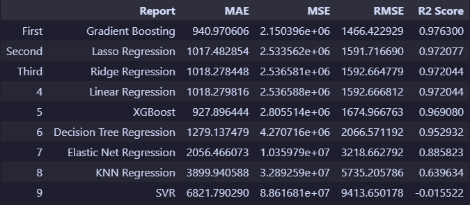
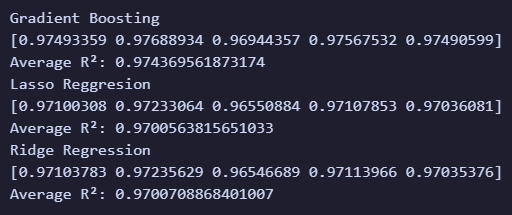

# 🚗 Used Car Price Predictor

A complete end-to-end Machine Learning project that predicts the selling price of used cars using multiple regression algorithms. This project demonstrates the full machine learning workflow, including data preprocessing, exploratory data analysis (EDA), model comparison, cross-validation, hyperparameter tuning, evaluation, visualization, and model persistence.

The objective of this project is to build an accurate regression model capable of estimating the selling price of a used car based on its specifications and historical sales data.

---

# 📑 Table of Contents

* [Project Overview](#-project-overview)
* [Dataset](#-dataset)
* [Machine Learning Workflow](#-machine-learning-workflow)
* [Data Preprocessing](#-data-preprocessing)
* [Models Used](#-models-used)
* [Model Performance](#-model-performance)
* [Cross Validation](#-cross-validation)
* [Hyperparameter Tuning](#-hyperparameter-tuning)
* [Project Structure](#-project-structure)
* [Installation](#-installation)
* [How to Run](#-how-to-run)
* [Results](#-results)
* [Project Completion](#-project-completion)
* [Project Summary](#-project-summary)
* [Author](#-author)

---

# 📖 Project Overview

Used car prices are influenced by many factors such as the manufacturer, model, mileage, vehicle condition, transmission type, body style, location, and current market value.

This project uses supervised machine learning to learn the relationship between these features and a vehicle's selling price. Multiple regression algorithms were trained, evaluated, compared, cross-validated, and optimized before selecting the final prediction model.

The project was built to demonstrate a complete end-to-end machine learning workflow rather than focusing on a single algorithm.

---

# 📊 Dataset

The dataset contains **over 400,000 used car sales records**.

## Features

| Feature      | Description                      |
| ------------ | -------------------------------- |
| COMPANY      | Vehicle manufacturer             |
| MODEL        | Vehicle model                    |
| SIZE         | Vehicle body type                |
| transmission | Transmission type                |
| state        | State where the vehicle was sold |
| condition    | Vehicle condition score          |
| odometer     | Total mileage                    |
| color        | Exterior color                   |
| interior     | Interior color                   |
| mmr          | Manheim Market Report value      |
| sale Day     | Day of sale                      |
| Sale month   | Month of sale                    |
| Sale year    | Year of sale                     |
| sellingprice | Target variable                  |

---

# ⚙ Machine Learning Workflow

The project follows the complete machine learning pipeline:

1. Exploratory Data Analysis (EDA)
2. Data Cleaning
3. Feature Engineering
4. Encoding
5. Train/Test Split
6. Feature Scaling
7. Train Multiple Regression Models
8. Initial Evaluation
9. Select Top Performing Models
10. 5-Fold Cross Validation
11. Hyperparameter Tuning
12. Final Prediction
13. Final Evaluation
14. Save Model

---

# 🧹 Data Preprocessing

The following preprocessing steps were performed before model training:

* Removed missing values.
* Removed duplicate records.
* Dropped unnecessary columns.
* Reduced high-cardinality MODEL values to the 200 most common models.
* Applied One-Hot Encoding to categorical variables.
* Split the dataset into training and testing sets.
* Applied Standard Scaling where required.

---

# 🤖 Models Used

The following regression algorithms were trained and evaluated:

* Linear Regression
* Ridge Regression
* Lasso Regression
* Elastic Net Regression
* K-Nearest Neighbors Regressor
* Decision Tree Regressor
* Support Vector Regressor (SVR)
* Gradient Boosting Regressor
* XGBoost Regressor

---

# 📈 Model Performance

Models were ranked primarily using **R² Score**, while **MAE** and **RMSE** were used as supporting evaluation metrics.

| Rank | Model                    |        MAE |        RMSE |   R² Score |
| ---- | ------------------------ | ---------: | ----------: | ---------: |
| 🥇   | Gradient Boosting        | **940.95** | **1466.38** | **0.9763** |
| 🥈   | Lasso Regression         |    1017.48 |     1591.72 |     0.9721 |
| 🥉   | Ridge Regression         |    1018.28 |     1592.66 |     0.9720 |
| 4    | Linear Regression        |    1018.28 |     1592.67 |     0.9720 |
| 5    | XGBoost                  |     927.90 |     1674.97 |     0.9691 |
| 6    | Decision Tree            |    1285.64 |     2085.94 |     0.9520 |
| 7    | Elastic Net              |    2056.47 |     3218.66 |     0.8858 |
| 8    | KNN Regressor            |    3899.94 |     5735.21 |     0.6396 |
| 9    | Support Vector Regressor |    6821.79 |     9413.65 |    -0.0155 |

After comparing all models, the **Gradient Boosting Regressor** achieved the best overall performance and was selected as the final prediction model.

---

# ✅ Cross Validation

The three best-performing models were further evaluated using **5-Fold Cross Validation**.

| Model                          | Average R² Score |
| ------------------------------ | ---------------: |
| 🥇 Gradient Boosting Regressor |       **0.9744** |
| 🥈 Ridge Regression            |           0.9701 |
| 🥉 Lasso Regression            |           0.9701 |

The cross-validation results confirmed that the **Gradient Boosting Regressor** consistently outperformed the other regression models and generalized well to unseen data.

---

# 🎯 Hyperparameter Tuning

To further improve model performance, hyperparameter tuning was performed on the top three models.

### GridSearchCV

Used for:

* Ridge Regression
* Lasso Regression

### RandomizedSearchCV

Used for:

* Gradient Boosting Regressor

### Best Hyperparameters

#### Gradient Boosting Regressor

```python
GradientBoostingRegressor(
    n_estimators=200,
    learning_rate=0.1,
    max_depth=5,
    min_samples_split=2,
    min_samples_leaf=1
)
```

#### Ridge Regression

```python
Ridge(alpha=10)
```

#### Lasso Regression

```python
Lasso(alpha=0.1)
```

---

# 📁 Project Structure

```text
Used-Car-Price-Predictor/
│
├── README.md
├── LICENSE
├── requirements.txt
├── .gitignore
│
├── car_prices_3.csv
│
├── model training.ipynb
├── model training.py
├── model.py
│
├── gradient_boosting_model.pkl
├── ridge_model.pkl
├── lasso_model.pkl
├── scaler.pkl
├── feature_columns.pkl
├── top_models.pkl
├── categorical_columns.pkl
│
├── model_comparison.csv
├── training.log
│
├── Images/
│   ├── Dataset preview.PNG
│   ├── evaluation_table.PNG
│   ├── cross_validation.PNG
│   ├── feature importance.PNG
│   └── Actual vs Predicited Graph.PNG
│
└── env/
```

---

# 💻 Installation

Clone the repository:

```bash
git clone https://github.com/yourusername/Used-Car-Price-Predictor.git
```

Move into the project directory:

```bash
cd Used-Car-Price-Predictor
```

Install the required packages:

```bash
pip install -r requirements.txt
```

---

# ▶ How to Run

1. Open the notebook using **Jupyter Notebook** or **Visual Studio Code**.
2. Run the notebook from top to bottom using **Run All**.
3. The notebook will automatically perform:

   * Data preprocessing
   * Model training
   * Model evaluation
   * Cross validation
   * Hyperparameter tuning
   * Final prediction
   * Feature importance analysis
   * Model saving

---

# 📷 Results

### Dataset Preview


### Model Performance



### Cross Validation



### Feature Importance


### Prediction vs Actual Values


---

# ✅ Project Completion

This project is considered complete in its current form.

It implements a complete machine learning workflow for a regression problem, including:

* Exploratory Data Analysis (EDA)
* Data Cleaning
* Feature Engineering
* Encoding
* Train/Test Split
* Feature Scaling
* Training Multiple Regression Models
* Model Evaluation
* Model Selection
* 5-Fold Cross Validation
* Hyperparameter Tuning
* Final Prediction
* Final Evaluation
* Model Saving

The primary objective of this project was to build, compare, optimize, and evaluate multiple machine learning regression models for used car price prediction. That objective has been successfully achieved, and no additional development is currently planned.

---

# 🏆 Project Summary

This project demonstrates a complete end-to-end machine learning workflow for a regression problem.

Starting from raw data, the project performs preprocessing, feature encoding, model training, model comparison, evaluation, cross-validation, hyperparameter tuning, visualization, and final model selection.

Among the nine regression algorithms evaluated, the **Gradient Boosting Regressor** delivered the best overall performance and was selected as the final prediction model.

---

# 👨‍💻 Author

**Syed Abdul Hadi**

Machine Learning Enthusiast

---

# ⭐ Support

## Author's Note

> This has been the most challenging machine learning project I have built so far, taking approximately **40 hours** to complete. Throughout this project, I gained practical experience with the complete machine learning pipeline—from preprocessing and model selection to cross-validation, hyperparameter tuning, evaluation, and model deployment. I look forward to applying everything I learned here to future machine learning projects.

If you found this project helpful or interesting, consider giving the repository a ⭐ on GitHub. Your support is greatly appreciated.
